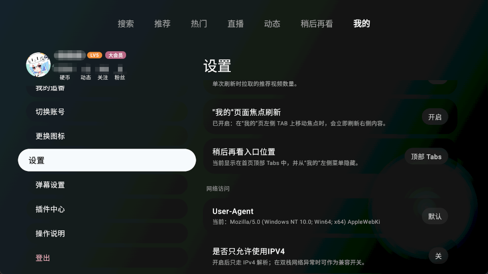
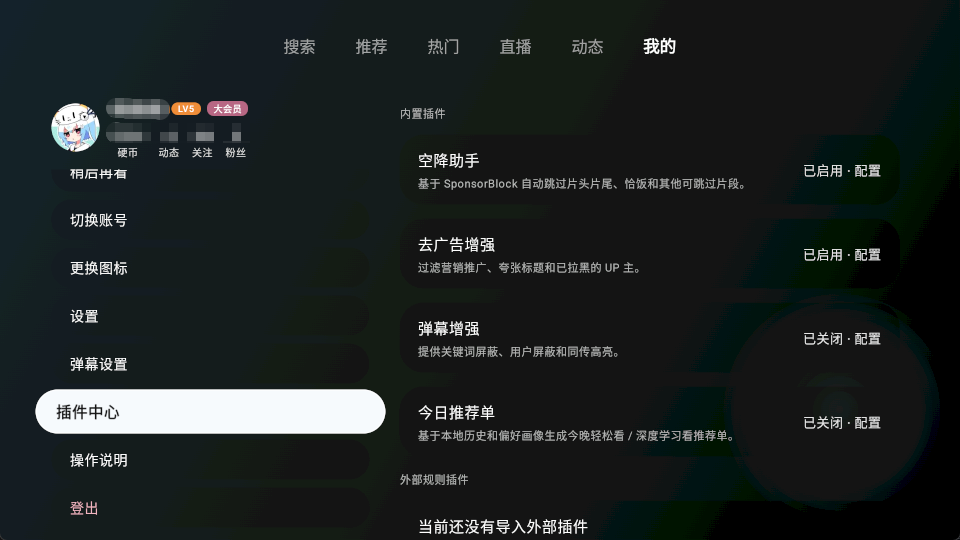
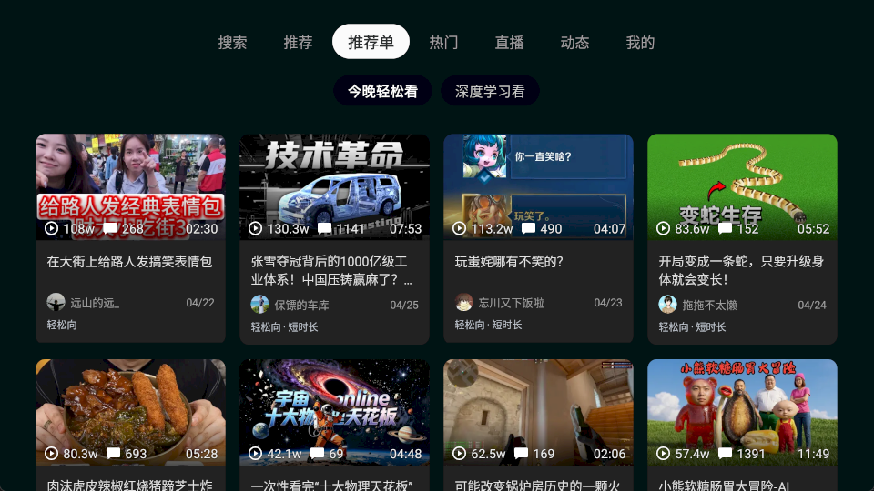
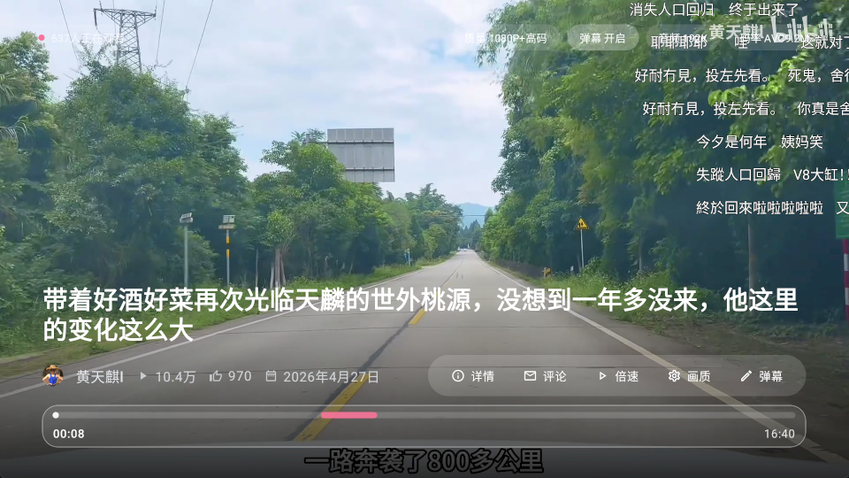
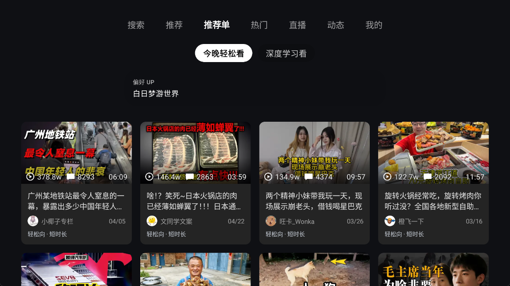
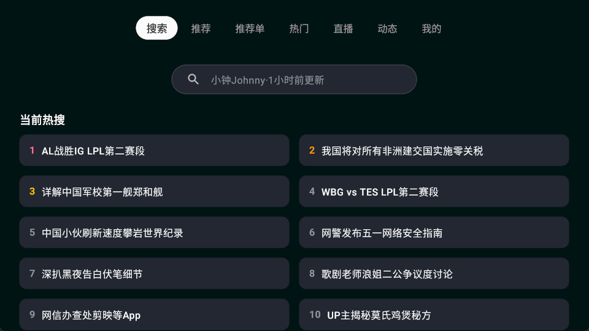

# BBTTVV

BBTTVV 是面向 Android TV 的第三方客户端，终极缝合挂，仅用于代替我的appletv。Compose及原生安卓开发，在电视上会导致很卡，所以借鉴了很多blbl项目

纯ai开发，有很多焦点乱跳及卡片按钮错位，在慢慢修复
先支持常用功能，直播、番剧等还没让ai改，可能会出现播放不了、闪退等

已知BUG:
不显示弹幕：点一下快进

## 核心特性
支持 4K / 1080P60 / HDR / Dolby Vision (需登录/大会员) 在TCL电视测试，可点亮

-同步上游推荐单，找不到喜欢的视频，可以开启推荐单功能，算法及推荐机制，可以查看上游仓库
的项目

支持空间助手，可同步数据库，跳过恰饭片段

支持查看评论，不过建议在视频卡片中看，视频详情页会导致卡顿

视频热力图，类似YouTube的效果

音量均衡，手动调整该app的音量，避免其他app声音很小，打开这个app突然的很大声

## 应用预览

为了直观展示应用的界面设计与交互效果，以下是各核心场景的截图与功能说明：

  
   
  <em>首页多 Tab 导航与视频网格：支持 D-Pad 顺滑浏览，流畅展示海量推荐内容。</em>
    
  
   
  <em>分区动态展示：快速浏览各个分区的热门视频与最新动态。</em>
    
  
   
  <em>视频详情页：提供丰富的视频介绍与相关视频推荐，焦点操作清晰稳定。</em>
    
  
   
  <em>播放界面与硬核调试面板：实时监控分辨率、帧率、码率及解码器等播放状态。</em>
    
  
   
  <em>播放设置与高级选项：支持清晰度切换、解码器选择及弹幕等设置，深度适配遥控器。</em>
    
  
   
  <em>特色播放功能：支持视频弹幕热力图展示，集成空降助手帮助快速跳转高能时刻。</em>

## 操作指南

本应用针对电视遥控器进行了深度适配，支持以下快捷操作：

- **方向键（D-Pad）**：控制页面内焦点的上下左右移动。支持从顶部导航栏无缝下移至内容区，并在边缘提供弹回或预加载效果。
- **确认键（Center/OK）**：短按确认进入详情；长按可触发内容的更多操作。
- **菜单键（Menu）**：在首页列表等流媒体页面，按下菜单键可一键刷新当前内容列表。
- **返回键（Back/Escape/B）**：返回上一级页面或退出当前状态。
- **调试面板**：在视频或直播播放页面中，可通过遥控器快捷键唤出 **硬核调试信息面板（Debug Overlay）**，实时查看分辨率、帧率、码率及丢帧等性能状态。

## 技术栈

- Kotlin 2.x，Java 21，Android Gradle Plugin 8.x
- Jetpack Compose、AndroidX TV Material、Compose Navigation
- Media3 ExoPlayer、Room、DataStore、Retrofit、OkHttp、Coil

## 本地开发

开发环境要求：

- JDK 21
- Android SDK，Compile SDK 36
- Android Studio 最新稳定版或兼容 AGP 8.x 的版本

### TV 焦点问题排查

遇到 Grid、Tab、播放器等 D-Pad 焦点乱跳时，可以临时加入 Debug-only 运行时日志，推荐统一使用
`BBTTVVGridFocus` 作为 logcat tag。排查完成后应删除临时日志点，避免常驻热路径。

建议记录以下信息：

- 输入事件：`KEYCODE_DPAD_UP/DOWN/LEFT/RIGHT/CENTER/BACK`、`ACTION_DOWN/UP`、`eventTime`。
- 当前焦点：`rootView.findFocus()`、是否为 RecyclerView 本身、是否在当前焦点区域内部。
- Grid 状态：focused adapter position、visible range、scroll state、item count。
- 焦点意图：pending focus key/position、scroll parking target、dataset restore target、request token。
- 数据变化：submitList 前后数量、append/refresh generation、稳定 key 是否仍存在。

## 上传前检查

仓库根目录已提供 `.gitignore`，用于排除 Gradle 构建产物、IDE 缓存、logcat / window dump、`local.properties` 以及签名文件。上传到 GitHub 前请确认不要提交以下本地文件：

- `local.properties`
- `keystore.properties`
- `*.jks` / `*.keystore`
- `logs/`、`build/`、`.gradle/`、`.kotlin/`

本应用为第三方开源实现，仅用于个人学习、研究与技术交流，不得用于商业发行或盈利。项目中展示和访问的图片、视频、评论等业务数据版权归原权利方所有。使用、复制、分发或部署本项目所产生的任何账号、法律和合规风险由使用者自行承担。
