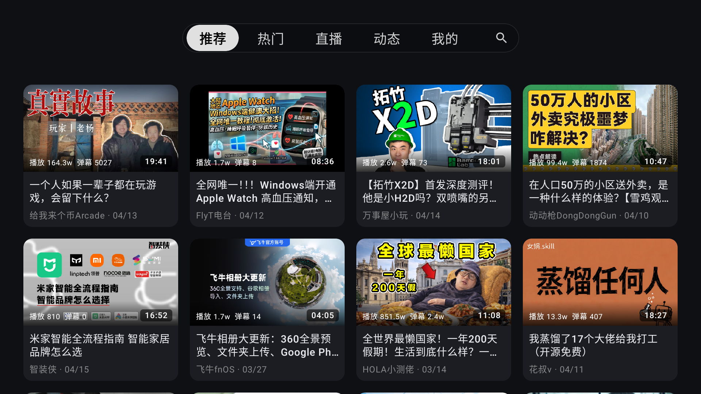

# BBTTVV

BBTTVV 是面向 Android TV 的第三方客户端，专为电视硬件打造的极致流畅体验。项目基于 Kotlin、Jetpack Compose、AndroidX TV Material、Media3 构建，重点优化了电视端遥控器 D-Pad 操作体验、首页多 Tab 导航性能、播放链路及多维度的调试信息，致力于实现流畅无卡顿的现代化 TV 应用。

## 应用预览

<p align="center">
  
  <br>
  
  <br>
  
</p>

## 核心特性

- **极致性能导航架构**：采用自定义的轻量级 `Box` 方案重构了顶部 Tab 导航和相关焦点管理。实现了零重组（Zero-recomposition）切换，显著降低 CPU/GPU 开销，杜绝了低端设备上的 UI 卡顿和焦点丢失问题。
- **完善的直播与点播播放器**：基于 Media3 ExoPlayer 构建的强大播放链路，解决各类直播流格式（如特定 FLV）的播放错误问题。具备完备的解码器回退与协商机制，确保视频内容稳定渲染。
- **硬核调试信息面板（Debug Overlay）**：在视频和直播播放页面中集成了详尽的调试信息面板，可通过遥控器快捷键唤出。实时显示：分辨率、帧率（FPS）、实时码率（Bitrate）、当前解码器内核（Codec）以及丢帧数（Dropped Frames），方便监控播放器性能状态。
- **为遥控器而生的交互**：
  - 支持使用 D-PAD 菜单键（Menu）一键刷新当前流媒体列表（推荐、热门、直播、动态等）。
  - 自动管理从顶部 Tab 栏到下方视频网格（Grid）的无缝焦点交接。
- **UI 与本地化保障**：彻底修复了部分界面（如弹幕设置、插件中心）的字符编码和乱码（Mojibake）问题，保障一致的专业视觉体验。
- **高效的内存管理**：重组了首页复杂 UI 的状态管理逻辑，通过生命周期感知设计在不同 Tab 切换时及时回收不再使用的 ViewModel，消除原有的“God Object”反模式，大幅降低后台内存占用。

## 技术栈

- Kotlin 2.x，Java 21，Android Gradle Plugin 8.x
- Jetpack Compose、AndroidX TV Material、Compose Navigation
- Media3 ExoPlayer、Room、DataStore、Retrofit、OkHttp、Coil

## 本地开发

开发环境要求：

- JDK 21
- Android SDK，Compile SDK 36
- Android Studio 最新稳定版或兼容 AGP 8.x 的版本

常用命令：

```bash
# 编译并安装 Debug 调试包到连接的电视或模拟器
./gradlew installDebug

# 运行 lint、单元测试和 release 构建验证
./gradlew tvVerification

# 构建 Release APK
./gradlew tvBuild

# 运行连接设备上的 UI smoke test
./gradlew tvUiRegression
```

Windows PowerShell 下可使用 `.\gradlew.bat` 替代 `./gradlew`。

## CI

仓库包含 GitHub Actions 工作流 `.github/workflows/android-tv.yml`，在 push、pull request 和手动触发时使用 JDK 21 执行验证：

```bash
./gradlew tvVerification --no-daemon --stacktrace
```

CI 只负责验证，不进行签名发布、GitHub Release 或外部对象存储上传。

## 免责声明

本应用为第三方开源实现，仅用于个人学习、研究与技术交流，不得用于商业发行或盈利。项目中展示和访问的图片、视频、评论等业务数据版权归原权利方所有。使用、复制、分发或部署本项目所产生的任何账号、法律和合规风险由使用者自行承担。
